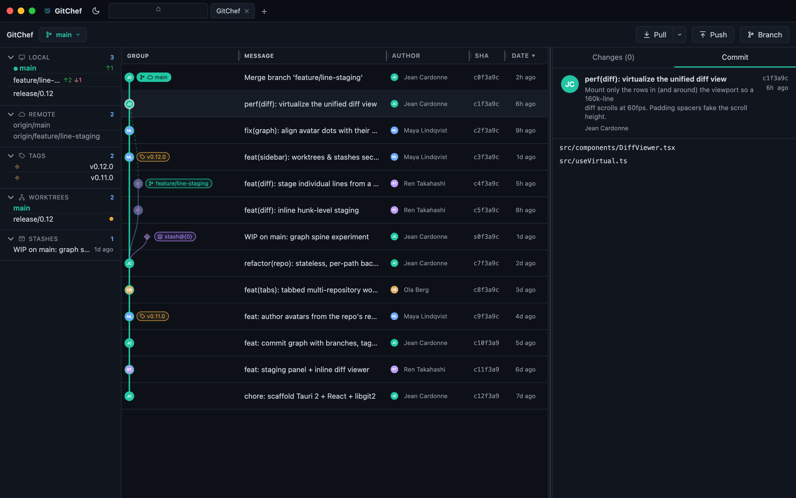
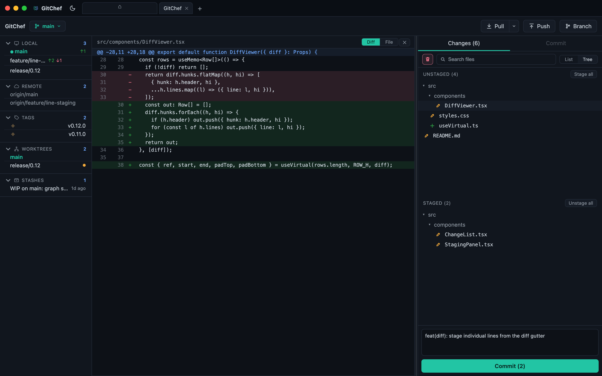

<p align="center">
  
</p>

<h1 align="center">GitChef</h1>

<p align="center">Open-source visual Git client. Fast, native, and cross-platform.</p>

---

GitChef is a desktop Git client built with [Tauri](https://tauri.app) and React. It pairs a tabbed, multi-repository workspace with a fast commit graph, inline diffs, and a focused staging flow, all inside a small native window.

## Screenshots

<p align="center">
  
  <br />
  <em>Browse history as a commit graph - branches, tags, remotes, stashes, and real author avatars.</em>
</p>

<p align="center">
  
  <br />
  <em>Stage changes and read inline diffs side by side, then commit - all in one view.</em>
</p>

## Features

- **Tabbed workspace** - keep multiple repositories open, color-code tabs to tell them apart, and switch between them.
- **Commit graph** - browse history with branches, tags, remotes, and stashes, with per-author avatars.
- **Author avatars** - commit authors show their real GitHub or GitLab profile picture (resolved from the repo's remote), falling back to Gravatar.
- **Staging panel** - stage, unstage, and discard changes from a searchable file list, with line- and hunk-level staging.
- **Diff viewer** - read inline or side-by-side diffs, flip to a full-file or blame view, and preview images.
- **Commit composer** - conventional-commit prefixes, co-authors, and amend.
- **Branch tools** - checkout, create, merge, rebase, cherry-pick, revert, and reset; interactive rebase planning.
- **Conflict resolution** - resolve merge/rebase conflicts inline, side by side.
- **Remotes & tags** - clone and init repositories; add, rename, remove, and re-point remotes; create, push, and delete tags.
- **Stashes** - create, apply, pop, drop, and re-message stashes.
- **Worktrees & submodules** - list and add worktrees; view and update submodules.
- **Search** - filter files, search commit metadata, and run content (`git grep`) and pickaxe (`git log -S`) history searches.
- **Pull requests** - open a GitHub PR or GitLab MR, and see review/CI status in the sidebar.
- **Quick open** - fuzzy-find and jump to any tracked file (Cmd/Ctrl+P) and a command palette (Cmd/Ctrl+K).
- **Recent repositories** - jump back into recently opened repos from the Home tab.
- **Theming** - light, dark, and system themes.
- **Auto-updates** - a built-in, signature-verified updater keeps installed builds current.

## Install

Grab the latest build for your platform from the [Releases](https://github.com/jcardonne/gitchef/releases) page:

- **macOS** - `brew install --cask jcardonne/gitchef/gitchef` (see the [tap](https://github.com/jcardonne/homebrew-gitchef)), or grab `GitChef_<version>_macOS.dmg` from the [Releases](https://github.com/jcardonne/gitchef/releases) page and drag GitChef to Applications. The app isn't notarized by Apple yet, so the first launch is blocked by Gatekeeper: right-click GitChef and choose **Open** (or run `xattr -dr com.apple.quarantine /Applications/GitChef.app`).
- **Windows** - `GitChef_<version>_Windows_setup.exe` (or the `.msi`). The installer isn't code-signed yet, so SmartScreen may warn - choose **More info -> Run anyway**.
- **Linux** - `GitChef_<version>_Linux.AppImage` (recommended: portable, runs on most distros, and auto-updating; `chmod +x` it then run - some systems need `libfuse2`). A `.deb` is also published for Debian/Ubuntu.

Once installed, GitChef checks for signature-verified updates on launch and updates itself in the background. Auto-update covers the macOS, Windows, and Linux **AppImage** builds; the Linux `.deb` updates through your package manager instead.

## Development

Prerequisites: [Node.js](https://nodejs.org) with [pnpm](https://pnpm.io), plus the [Rust toolchain](https://www.rust-lang.org/tools/install) for the Tauri backend.

```bash
pnpm install        # install frontend dependencies
pnpm tauri dev      # run the full app in development
```

To run only the frontend dev server (no native shell), use `pnpm dev`.

## Build

```bash
pnpm tauri build    # produce a native bundle for the current platform
```

Bundles and installers are written to `src-tauri/target/release/bundle/`.

## Tech stack

- [Tauri 2](https://tauri.app) - native shell, window chrome, and bundling.
- [React 18](https://react.dev) + [TypeScript](https://www.typescriptlang.org) - UI.
- [libgit2](https://libgit2.org) (via `git2`) for local reads; network operations delegate to the system `git` CLI.

## Project layout

```
src/            React frontend (components, state, styling)
src-tauri/      Rust backend, Tauri config, and bundle icons
docs/           Project documentation (see RELEASING.md)
```

## Tests

```bash
pnpm test                       # frontend unit tests (vitest)
cargo test --manifest-path src-tauri/Cargo.toml   # Rust backend tests
```

End-to-end tests (`e2e/`) drive the real Tauri binary via WebKitWebDriver and run in CI on Linux.

## Star History

<a href="https://www.star-history.com/?repos=jcardonne%2Fgitchef&type=date&legend=top-left">
  <picture>
    <source media="(prefers-color-scheme: dark)" srcset="https://api.star-history.com/svg?repos=jcardonne/gitchef&type=Date&theme=dark" />
    <source media="(prefers-color-scheme: light)" srcset="https://api.star-history.com/svg?repos=jcardonne/gitchef&type=Date" />
    
  </picture>
</a>
